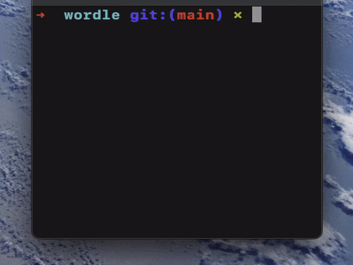

# wordle

## Guess a 5-letter word

Implementing the wold-famous game ***[Wordle](https://www.nytimes.com/games/wordle/index.html)*** in the terminal:



This was made in **2023**, but only uploaded it here later.

## 📖 Topics
  - Game development
  - Terminal

## 🛠️ Langs/Tools
  - Python

## 🦉 Getting started

  1. ```git clone https://github.com/kenlies/wordle```
  2. ```cd wordle```
  3. ```python3 wordle.py```

## 🔨 To improve

Making the game more interactive and fun. Next, make this work in a web application. Use a more comprehensive wordlist.
